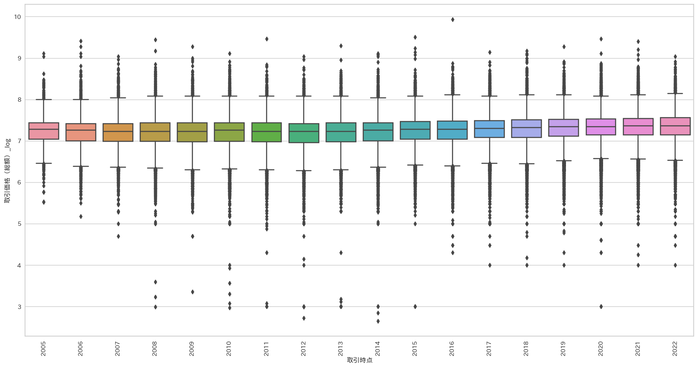
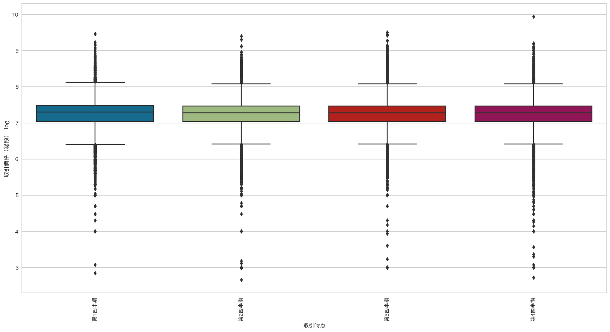
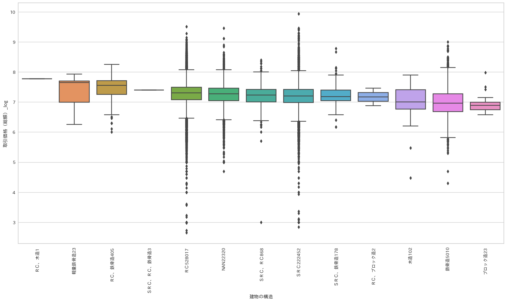
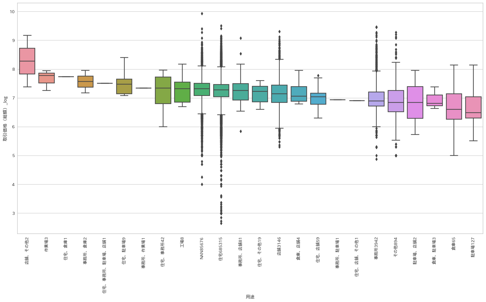
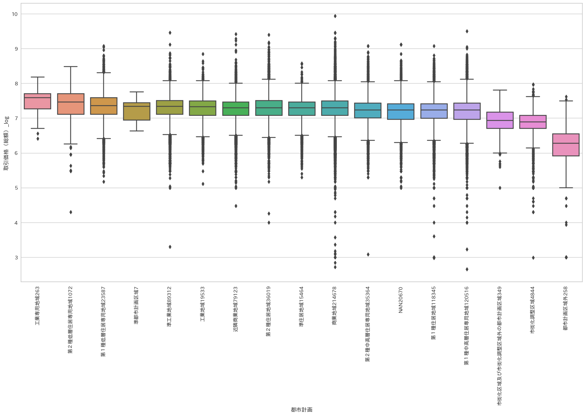
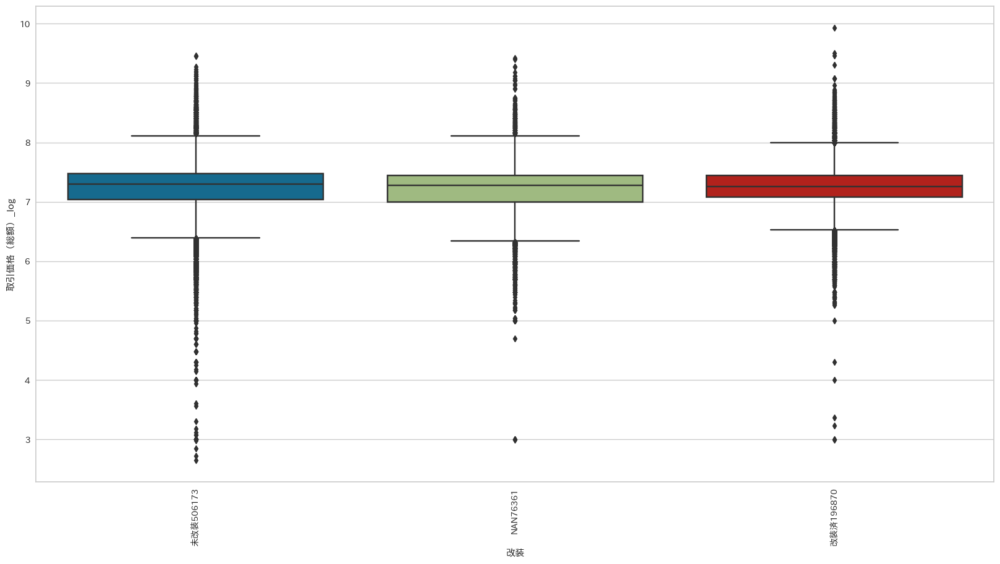

## 取引年ごとの価格



## 取引時期ごとの価格



## 建物の構造と価格



## 用途と価格の関係



- [ ] 「用途」を「住宅」「駐車場」「店舗」「事務所」「製造」に分類

## 都市計画と価格



## 改装と価格



改装している方が価格がやすい。築年数と関係があるからか。おそらく同じ築年数で、改装・未改装であれば改装済の方が高い

## メモ

決定木は、欠損値補完をしなくて良い。

[QA: Target Mean Encoding - wakame](https://scrapbox.io/wakame/Q&A:_Target_Mean_Encoding)

## 自作関数一覧

```python
def get_arrangement(layout):
    """
    Get the arrangement details based on the given layout.

    Parameters:
    - layout: str or any
        The layout string or object.

    Returns:
    - arrangement: str
        The corresponding arrangement based on the layout.
    - num_rooms: int
        The number of rooms.
    - service_room: int
        Indicator for the presence of a service room (1 if present, 0 otherwise).
    - kitchen: int
        Indicator for the presence of a kitchen (1 if present, 0 otherwise).
    """
    arrangements = {
        "ＬＤＫ": "LDK",
        "ＬＤ": "LDK",
        "Ｌ": "LDK",
        "ＤＫ": "DK",
        "ＬＫ": "DK",
        "Ｄ": "DK",
        "Ｋ": "K",
        "Ｒ": "R",
    }
    num_rooms = 1
    service_room = 0
    kitchen = 0
    if isinstance(layout, str):
        # 一文字目が数字の場合
        if layout[0].isdigit():
            # 最初の一文字と、"＋"以降の文字を削除
            arrangement_type = layout[1:].split("＋")[0]
            arrangement = arrangements[arrangement_type]
            # 部屋数を抽出
            num_rooms = int(layout[0])
            if "Ｓ" in layout:
                service_room = 1
            if "＋Ｋ" in layout:
                kitchen = 1
        else:
            arrangement = layout
    else:
        arrangement = layout
    return arrangement, num_rooms, service_room, kitchen
```
